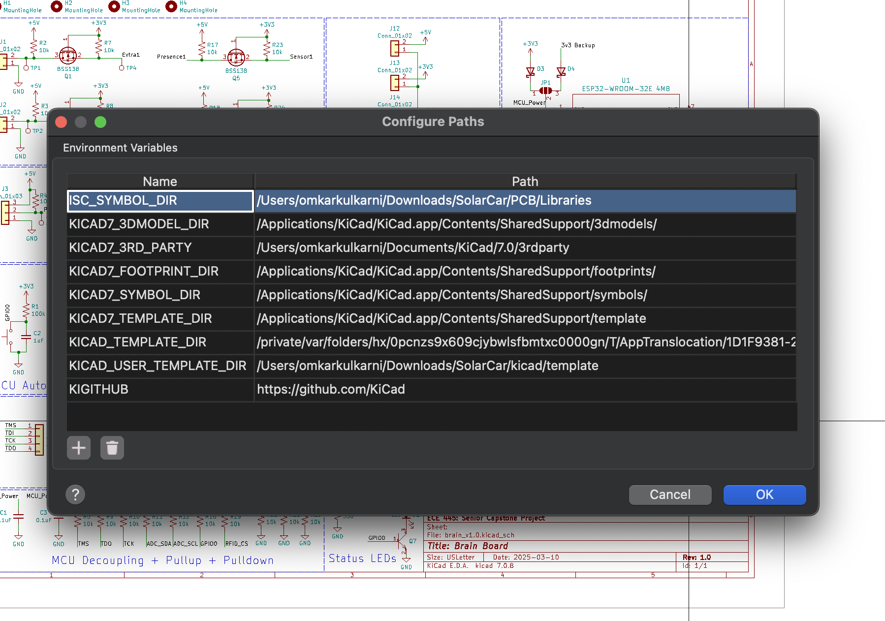
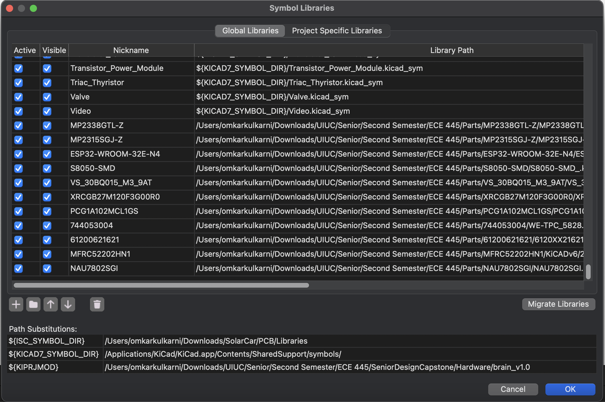
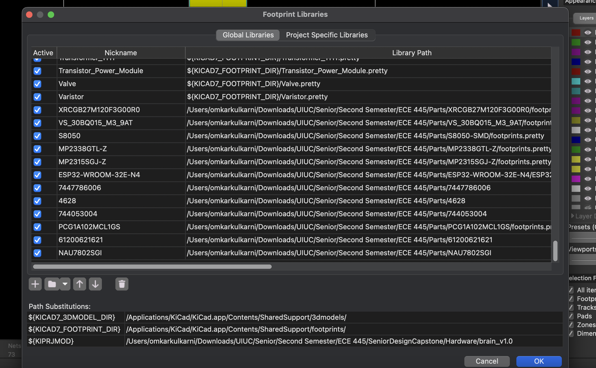

# KiCAD Board Repository

This is the hardware repository with all of our KiCAD boards. We have five: two power boards, a brain board, an RFID board, and the motor driver board. If you are unable to see symbols on the schematic capture, you will need to go to schematic editor->Preferences->Configure Paths and manually add a large parts library that you can link from Hardware/Libraries folder courtesey of Illini Solar Car.

For all of the parts that we dowloaded from 3rd party sites, there is a folder called Parts (Hardware/Parts), which has the symbols, footprints, and some .step files. This can be linked by going to schematic editor->Preferences->Manage Symbol Libraries. The same must be done for all the footprints in the PCB editor under Preferences->Manage Footprint Libraries. Three images below depict the path libraries for Omkar's KiCAD.

