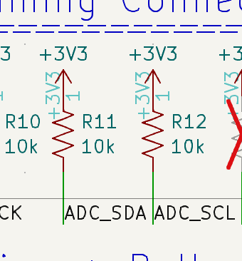
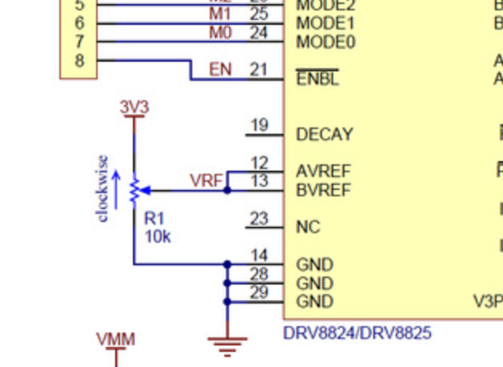
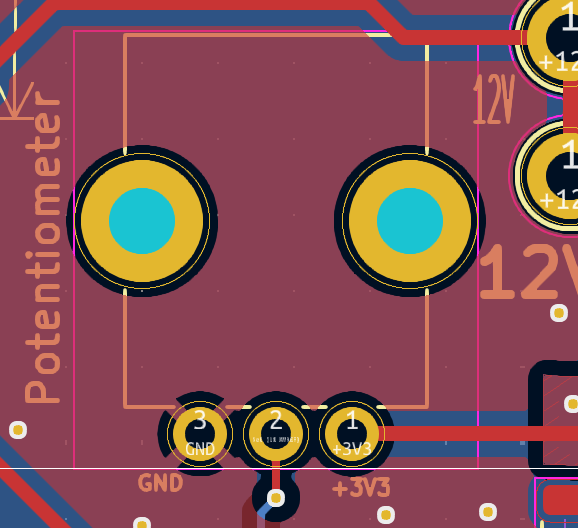
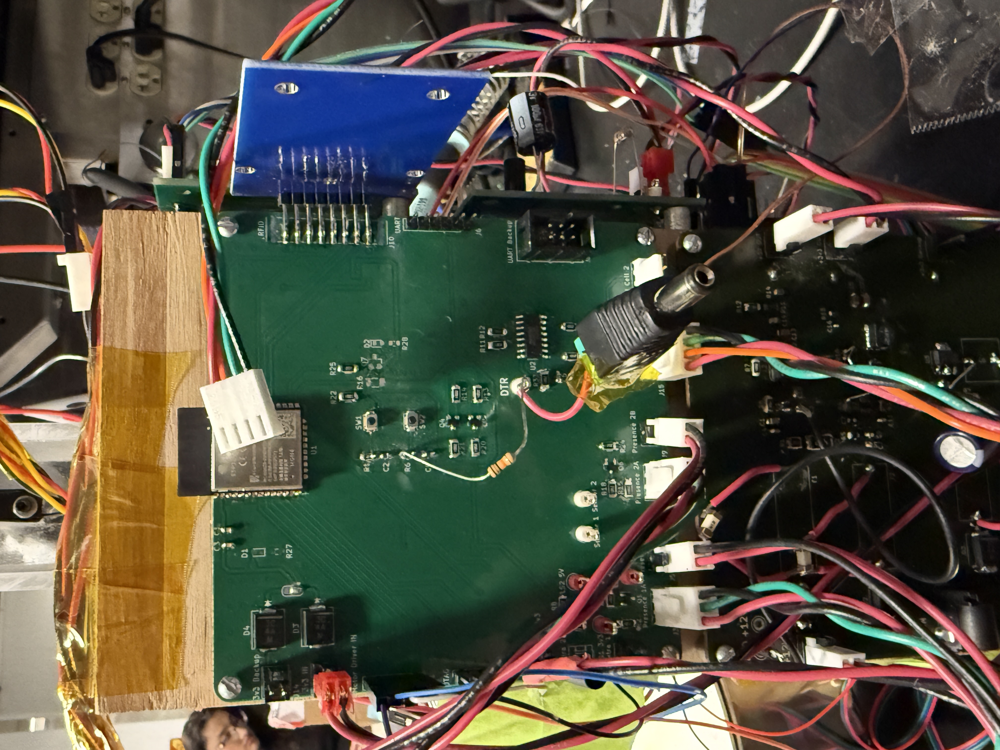
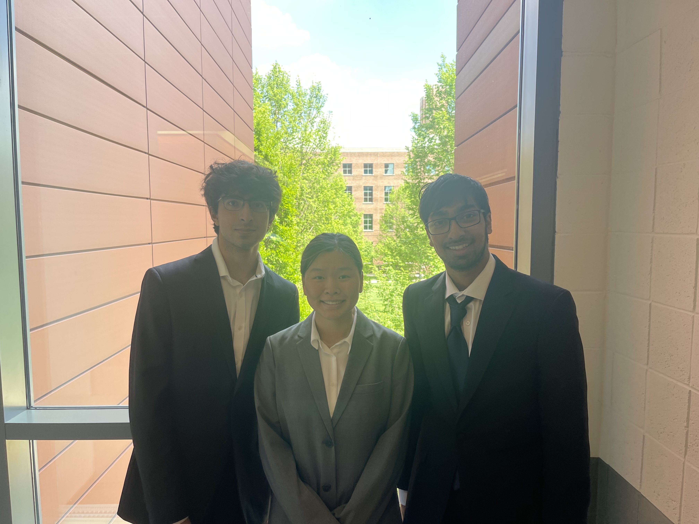

Arash Amiri Engineering Notebook ECE 445 Spring 2025

January 21, 2025

During class, we listened to a lot of ideas and heard various feedback on the types of projects that are suggested for the scope of this course. I worked with my two team members and finalized the group and its goal.
After the class, we made an initial web-board post on a potential power for laptop-to-laptop charging.

January 24, 2025

We all met as a group to check the feedback received from the TAs. We then went on to look at other various project avenues and ideas. One idea we came up with was a smart security system that was
more complete and had more sensors than usual things seen.

January 27, 2025

We all met in the ECE 445 Senior Design Lab to go over all the feedback received since the last meetup. There was growing concern about the commonness of the security system and we talked to the TA regarding
his suggestions on how to make our project get approved or if he had any possible fixes. The idea of a pet food dispenser came about as we were bouncing ideas off and Michael Molter helped get our idea
converted into a more profound end-to-end project.

January 28, 2025

Worked on the Team contract with the team as we awaited RFA project approval. I looked at a high-level timeline for what progress throughout this semester should look like and started checking out
pros and cons of various microcontrollers, sensors, and protocols. I started looking at parts both physical and those more related to electrical components.

February 10, 2025

Talked to Gregg from the ECE Supply Shop to discuss various issues and kinks with our project. Got a better idea of what the design would look like and what parts are needed. Went over the various kinds of
motors that can run this project and how to handle the lid system. Started and made almost finished progress on the Proposal document.

February 11, 2025

Went back to Gregg to get a more finalized design and what parts to include. With my team, I voiced a few concerns on simple design choices just to know what to better expect when we build the design.
Looked at some ESP32 specifications to make sure the additions and fixes are within scope.

February 13, 2025

Finalized the presence sensor I was using and drew the circuit for it on how we were going to attach it to the GPIO pins.

Photo: 
Part: https://www.adafruit.com/product/2168

February 17, 2025

We had our weekly TA meeting and we just discussed PCB design progress and the vision on how we going about everything else. Showed how now we waiting for the parts more.

February 20, 2025

Looked at the load cell for the ADC and made sure the PCB schematic handled the pull down resistors properly for the logic pins.

Photo #1: 

Photo #2: 

February 24, 2025

This was also a weekly meeting with our TA. I did more part ordering and sourcing. We went over feedback from our proposal review, possible issues we could see and how to go about it, and also what to show for our breadboard demo.

February 25, 2025

I helped Omkar with the RFID circuit and its parts while Kathryn worked on the database and website components.

March 4, 2025

Talked to Aishee about stencils and how we can use them with the oven. Discussed immediate next steps to not fall behind.

March 6, 2025

Worked on getting as many deliverables for the breadboard demo. Worked to figure out what data to show on the website and how we went about using a battery to power everything. Got a plan ready on how we would get everything working with each other as parts were arriving that weekend. FIgured out that we can use an Arduino and use its 3.3V and 5V for immediate breadboard demonstration.

March 10, 2025

No TA meeting due to Breadboard Demo. Looked at how I'll go about the ADC part of the project from a code standpoint.

Code:
#include <Adafruit_NAU7802.h>

Adafruit_NAU7802 nau;

void setup() {
Serial.begin(115200);
Serial.println("NAU7802");
if (! nau.begin()) {
Serial.println("Failed to find NAU7802");
while (1) delay(10); // Don't proceed.
}
Serial.println("Found NAU7802");

nau.setLDO(NAU7802_3V0);
nau.setGain(NAU7802_GAIN_128);
nau.setRate(NAU7802_RATE_10SPS);

// Take 10 readings to flush out readings
for (uint8_t i=0; i<10; i++) {
while (! nau.available()) delay(1);
nau.read();
}

while (! nau.calibrate(NAU7802_CALMOD_INTERNAL)) {
Serial.println("Failed to calibrate internal offset, retrying!");
delay(1000);
}
Serial.println("Calibrated internal offset");

while (! nau.calibrate(NAU7802_CALMOD_OFFSET)) {
Serial.println("Failed to calibrate system offset, retrying!");
delay(1000);
}
Serial.println("Calibrated system offset");
}

void loop() {
while (! nau.available()) {
delay(1);
}
int32_t val = nau.read();
Serial.print("Read "); Serial.println(val);
}

March 11, 2025

All the dev boards for all the subsystems arrived today. We spent the whole day getting Arduino code working for each component. So we had to first connect the presence sensors, then the 4 wires of the load cell to the ADC, and putting the motor into a 12V power supply and analyzing movement.

Photo:

March 12, 2025

This was our breadboard demo. We were able to show each subsystem working and a high level of how our project would look like. We got full points as we were able to describe functionality and logic code.

Photo:

<< No Meetings due to Spring Break >>

March 24, 2025

Quick regroup meeting with Aishee, our TA. Explained to her how we dropped off all the parts to the machine shop before spring break and what we want to work on next. Soldering the boards we have at the moment for the future, power and brain.

March 25, 2025

As a group we organized all the parts and started soldering all the SMD components. This took a very long time.

March 27, 2025

As I was soldering the new motor board I realized I had grouped the resistor with a potentiometer and did not differentiate their footprints. I stopped soldering and started designing a new board right away.

Photo:

March 31, 2025

We had our weekly TA meeting today and I explained one possible issue we had. I submitted a new board for the motor board for PCB ordering.

Photo:

April 1, 2025

Helped solder the brain board more and looked into the power board. Helped unit test and figure out why power wasn't working. Realized the circuit was missing a pull down resistor and that the backup barrel connector was generating the correct 3.3V.

Photo:

April 3, 2025

Started to look into the programmer we bought from Amazon and which pins we needed to program the ESP32 through the connector we laid out. After lots of trial and error I pointed out that we need a pull down resistor in the programming circuit that we didn't currently have.

Photo:

April 7, 2025

Since the programming worked, we were able to validate that the MCU could receive the appropriate power, and get code uploaded through the Arduino IDE application. Our TA Aishee, was very happy that we could verify our soldering and get a program sent to the MCU. This is one of the harder and most important parts of the project. If it didn't work we had to figure out if it was a poor circuit design or poor soldering job.

April 8, 2025

Helped out with part ordering and making sure all e-shop parts that we needed to change and add were ordered. Organized the bags by number for easier soldering. Started to at a high level look at overall logic and possible tutorials online.

April 10, 2025

As the load cell needed the power fully figured out and needed the Brain board, I turned to make sure the presence sensor worked and could register its readings across both pairs.

Code:
  //for the food store
  sensorStatea = digitalRead(presence_sensor_a);
  if (sensorStatea != lastStatea) {
    Serial.println(sensorStatea ? "sensor a is Unbroken" : "sensor a is Broken");
    lastStatea = sensorStatea;

String payload = "{\"sensor\": \"a\", \"id\": " + String(1582741251) + ", \"value\": " + String(sensorStatea) + "}";
    String response = send_data(payload);
  }

sensorStateb = digitalRead(presence_sensor_b);
  if (sensorStateb != lastStateb) {
    Serial.println(sensorStateb ? "sensor b is Unbroken" : "sensor b is Broken");
    lastStateb = sensorStateb;  // update last known state

String payload = "{\"sensor\": \"b\", \"id\": " + String(1582741251) + ", \"value\": " + String(sensorStateb) + "}";
    String response = send_data(payload);
  }

April 14, 2025

Aishee our TA was a little worried about progress on the motor and overall functionality but was happy with the overall power work and design. Started to realize that the load cell will not be the most easy to work with.

April 16, 2025

Our motor started not spinning properly and kept getting stuck and going the wrong way. I realized that we weren't pulling down the M0, M1, and M2 pins of the DRV chip. Made a new PCB and self-ordered it.

Photo: 

April 17, 2025

Got the code working with the dev board for the lid to get ahead on some of the functionality things while we waited for the PCB to arrive.

Code:
{
//
Motor 2: 90 degrees out and back

int steps90deg = stepsPerRevolution / 4;
// 90degrees = 50 steps

// Move forward 90 degrees
motor2.move(steps90deg);
motor2.runToPosition();

delay(500); // Pause

// Move backward 90 degrees
motor2.move(-steps90deg);
motor2.runToPosition();
}

April 22, 2025:

We realized that we started having the motor not spin and looked more into the documentation. We realized that we were using the wrong current and looked at the Vref calculations. Our motor was rated at 1.5A. We also looked at tuning the potentiometer to figure out what position allowed optimal motor functionality.

Vref = Current Limit / 2 which meant Vref = 0.75 V.

April 24, 2025

Re-soldered the motor board and ran it the way it was plugged in when we used the dev board. Finally got the PCB version of the motor board working.

Photo: motor_final.JPG

April 26, 2025

Aishee, our TA came by to check on our progress and gave us pointers on how to maximize our project's functionality points. We soldered all the remaining through hole components and started connecting all wires that weren't connected.

April 27, 2025

After working with both load cells, we started to realize that one of them is just a defective part as it kept shorting. I was able to get the 3D print of the button figured out and printed.

I thought the button logic would be more straightforward but realized there were some state issues and debouncing problems. Finally got it to register the clicks the way we intended to use them rather than registering the lift and press as two clicks.

We used a "On-Off Power Button / Pushbutton Toggle Switch Product ID: 1683"

Photo: 3D_Print.png

Code:
const int buttonPin = 27;
bool lastButtonState = HIGH;
bool currentButtonState = HIGH;
unsigned long lastDebounceTime = 0;
const unsigned long debounceDelay = 50; // debounce time

// Global flag
bool buttonPressed = false;

void setup() {
Serial.begin(115200);
pinMode(buttonPin, INPUT_PULLUP);
}

void loop() {
buttonPressed = false; // Reset at the start of each loop

int reading = digitalRead(buttonPin);

if (reading != lastButtonState) {
lastDebounceTime = millis();
}

if ((millis() - lastDebounceTime) > debounceDelay) {
if (reading != currentButtonState) {
currentButtonState = reading;

      if (currentButtonState == LOW || currentButtonState == HIGH) {
        buttonPressed = true;
      }
    }

}

lastButtonState = reading;

if (buttonPressed) {
Serial.println("Detected a button");
}
}

April 28, 2025

We started to test that the code for each susbystem worked and started to combine the overall logic of everything. We were in the lab until 4am testing if RFID was being detected and if the button logic was correct.

Code:

unsigned long dispenseStartTime = millis();
int32_t lastAvgAdcValue = adc_start;

while (true) {
digitalWrite(stepPin1, HIGH);
delayMicroseconds(2000);
digitalWrite(stepPin1, LOW);
delayMicroseconds(2000);

static int stepCounter = 0;
stepCounter++;

if (stepCounter >= 100) {
stepCounter = 0;

    Serial.println("Checking weight");

    int32_t sum = 0;
    for (int i = 0; i < 5; i++) {
      while (!adcA.available()) delay(1);
      sum += adcA.read();
      delay(50);
    }
    int32_t avgAdcValue = sum / 5;

    Serial.print("Average ADC Reading: ");
    Serial.println(avgAdcValue);

}
}

This code turns on the motor by the dir and step pins and then starts reading average ADC values for each spin.

Photo:

April 29, 2025

We as a group were able to complete our demo and everything worked the way we expected it to work. We were very happy with our non-breadboard design.

May 05, 2025

Everyone met up to work on the PowerPoint for our presentation. We also went back to the lab to collect data like the voltages for the battery.

May 06, 2025

As a team, all three of us went to the CIF and worked on the final paper with help from our previous documents, like the design document. Earlier in the day we all dressed up in professional attire and did our final presentation for our project.

Photo:

May 08, 2025

Met with everyone one last time and did the locker checkout. We also completed the evaluations on the course.
