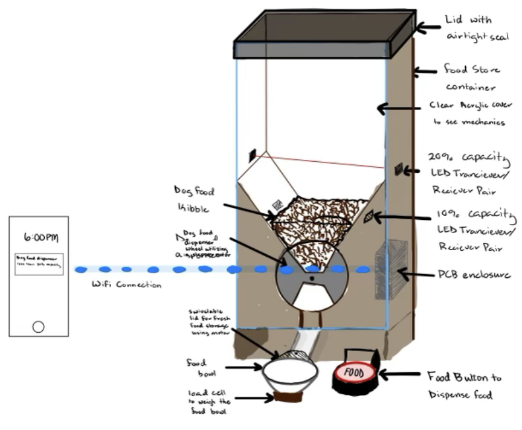
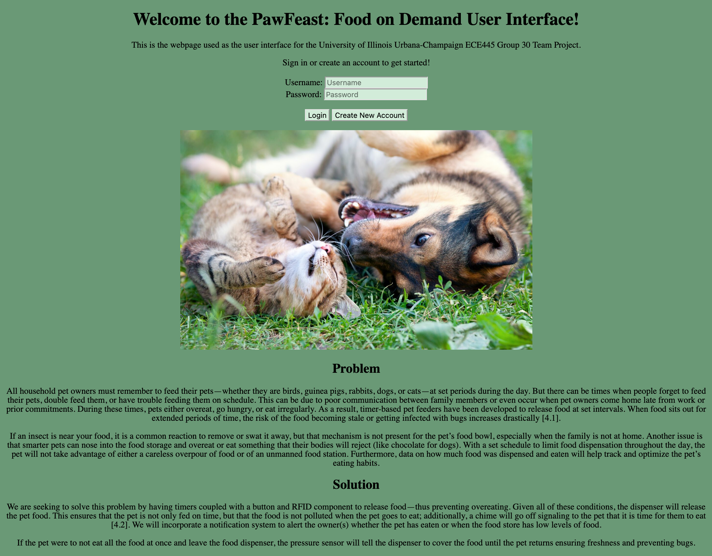
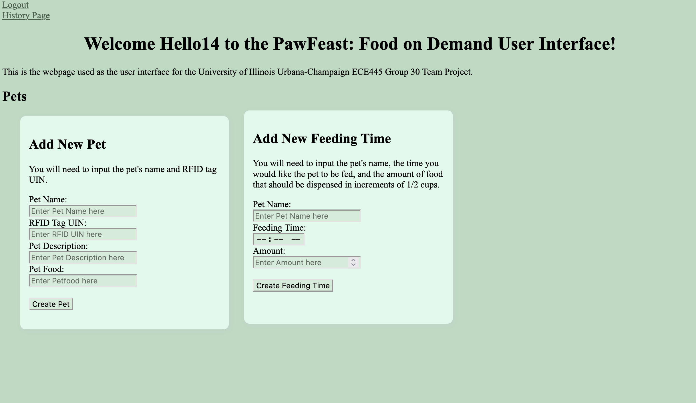
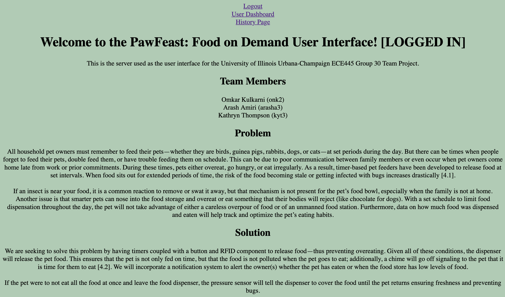
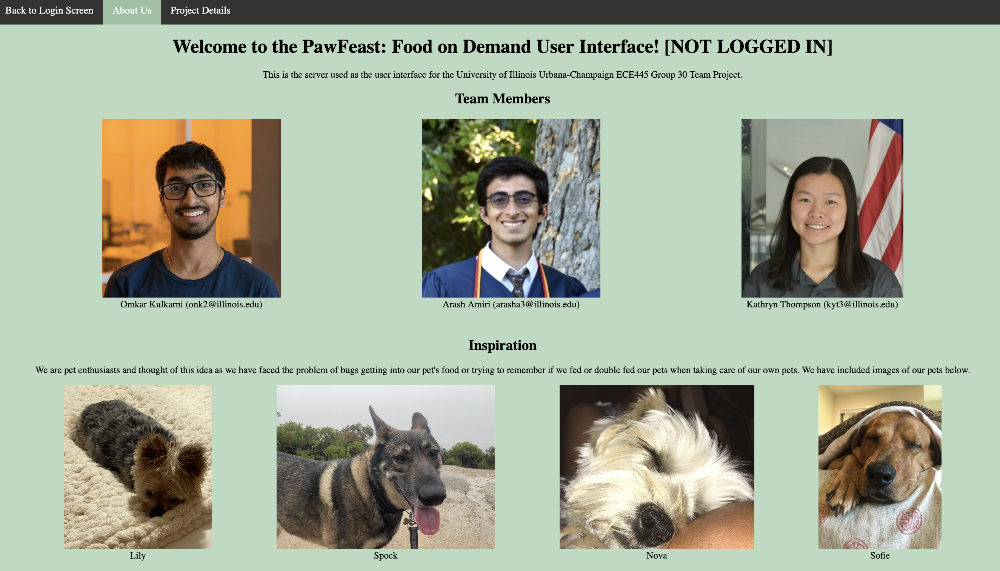
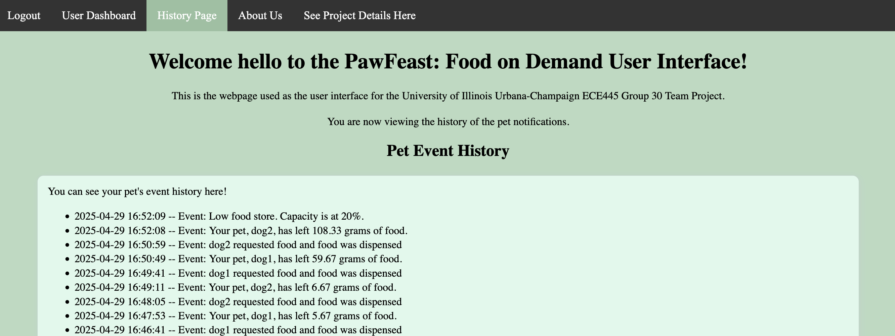

## Template for Notebook Entries
Date:         _xx/xx/xxxx_  
Objectives:   _What are the goals for the meeting?_  
Record:       _What did we accomplish?_

## Meeting #1
Date:         _12/31/2024 (Recorded for reference on 1/23/2025)_  
Objectives:   The goal of this meeting was to meet my teammates and brainstorm ideas of what we could work on for our project.  
Record:       While meeting, we made suggestions of what we could work on. These ideas include the following:  
  1. Power conversion  
  2. Solar  
  3. Microcontroller  
  4. Solar power
  5. Something cyber related?
  6. Vehicle related
  7. Smart charger
  8. What to charge?
  9. Normal battery pack w/ Lithium ion battery
  10. Power source -> middle tool -> dispense to battery
  11. usbguard/equivalent for security to only allow authorized devices to connect

By the end of this meeting, we decided that we would work on something related to a smart charger. 

## Meeting #2
Date:         _1/21/2025 (Recorded for reference on 1/23/2025)_  
Objectives:   The goal of this meeting was to finalize the project idea and to submit a post to the web board for the initial project approval.  
Record:       At this meeting, we confirmed that we did want to pursue the smart charger project. We refined our project to focus on laptop-to-laptop charging capabilities, and added complexity by adding battery health monitoring and possibly being able to set a battery percentage value for the device to charge up to.  

At the end of this meeting, we submit our initial web board post.

## Meeting #3
Date:         _1/24/2025 (Recorded for reference on 1/28/2025)_  
Objectives:   The goal of this meeting was to discuss feedback received for our project idea and to decide to continue pursuing the project idea or look for a new idea to pursue.   
Record:       At this meeting, we confirmed that we could not continue to pursue the smart charger project due to TA feedback. We then brainstormed additional ideas and came up with a cheap, complete security system for college apartments.  

At the end of this meeting, we submit our initial web board post.

## Meeting #4
Date:         _1/27/2025 (Recorded for reference on 1/28/2025)_  
Objectives:   The goal of this meeting was to discuss feedback received for our project idea and to decide to continue pursuing the project idea or look for a new idea to pursue.  
Record:       After talking to TA's Jiankun and Michael, we determined that our idea for a security system may not be the best to pursue as our distinguishing factor is price and completeness as completeness is something that has already been achieved, it's just pricier.  

We then decided to focus on looking at pet feeders that feed pets while maintaining the freshness of the food. We submit the initial post to the web board for approval.

## Meeting #5
Date:         _1/28/2025_  
Objectives:   The goal of this meeting was to discuss feedback received for our project idea and draft a response to the feedback received entailing the project subsystems.  
Record:       After receiving feedback from Jason, we drafted our list of subsystems for our food dispensor.

At the end of this meeting, we posted our Project Proposal.

## Meeting #6
Date:         _2/3/2025_  
Objectives:   The goal of this meeting is to finish the soldering assignment, make the team contract, and set our goals for the semester.   
Record:       Team Contract is completed only requiring the addition of the meeting time with the TA. Project has been approved. Goals have been set.  

## Meeting #7
Date:         _2/10/2025_  
Objectives:   The goal of this meeting was to talk to Greg about project design and to work on project proposal.   
Record:       Project proposal was largely completed. Met with Greg for the first time. Drew a rough sketch of the physical design.  


## Meeting #8
Date:         _2/11/2025_  
Objectives:   The goal of this meeting was to further define project design with Greg and what we need to aquire for him. Additional goals were to work on project proposal.   
Record:       Project proposal was completed for review at TA meeting. Finalized design with Greg. Determined we needed to aquire a load cell for weight sensing, a motor for covering the food bowl, a stepper motor for food dispensing, a button to determine the presence of a dog, at least 2 LED tranceiver/receiver sets for food store capacity, and a food bowl to dispense food into. In addition, we needed to get a sample of dog food for Greg to get an idea of size.

## Meeting #9
Date:         _2/18/2025_   
Objectives:   The goal of this meeting was to practice our presentation for the Design Review.  
Record:       Practiced presentation for review tomorrow at 3PM. We agreed that we would meet 15-20 minutes in advance of the Proposal Review.

## Meeting #10
Date:         _2/24/2025_   
Objectives:   The goal of this meeting was to go over feedback from proposal review, finalize parts list and look at next steps. Met with TA for the last hour.    
Record:       Deliverables for breadboard demo:  
  1. project uses 2 or 3 different sensors working
  2. code running on microcontroller
  3. read and understand signals from the differrent sensors
  4. recieving some sort of thing
  5. microcontroller communication app is working, the app receives updates from the microcontroller
  6. motor works (on off), esp can send signals to change the speeds (dependent on the drivers)
  7. bluetooth to app good (but not critical)
  8. CODE IS VERY IMPORTANT
  9. app can be done in a week: mongodb, react

## Meeting #11
Date:         _2/25/2025_   
Objectives:   The goal of this meeting was to work on circuit, RFID, parts, and database.  
Record:       During this meeting, Omkar worked on the Brain circuit, Arash worked on the RFID parts, and I worked on the Database schema.  

Files for the database can be referenced [here](./database_schema.md).

References:  
```
MySQL “MySQL :: MySQL 8.4 Reference Manual :: 5.3 Creating and Using a Database.” MySQL :: Developer Zone, https://dev.mysql.com/doc/refman/8.4/en/database-use.html. Accessed: 2 April 2025. 11. “Removing rows from a table using the DELETE statement.” IBM, IBM, 11 April 2023, https://www.ibm.com/docs/en/i/7.4?topic=language-removing-rows-from-table-using-delete-statement. Accessed: 2 April 2025.
```

## Meeting #13
Date:         _3/4/2025_   
Objectives:   The goal of this meeting talk to Aishee Mondal about our power and brain breadboard in order to order the first round of PCBs.  
Record:       During this meeting, talked with Aishee about deliverables, went over schematics, requested stencils for the PCBs, discussed parts ordering and immediate plan.  

## Meeting #14
Date:         _3/5/2025_   
Objectives:   The goal of this meeting finish the design document (due 3/6).  
Record:       During this meeting, we worked on the parts list, cost analysis, and Requirements and Verification Table. Outside of the parts list, the design document was finished. We will begin majority of parts ordering this weekend along with testing of sensors and MCU/ESP32 chip. I worked on the user interface. The database is fully created and connected with our backend. The backend is connected to our frontend. As of now, we are able to create users, login, and logout.  

A detailed description of our database schema can be found at [here](./database_schema.md).

This is a screenshot of the current version of the code.




References:  
```
MySQL “MySQL :: MySQL 8.4 Reference Manual :: 5.3 Creating and Using a Database.” MySQL :: Developer Zone, https://dev.mysql.com/doc/refman/8.4/en/database-use.html. Accessed: 2 April 2025.  

“Removing rows from a table using the DELETE statement.” IBM, IBM, 11 April 2023, https://www.ibm.com/docs/en/i/7.4?topic=language-removing-rows-from-table-using-delete-statement. Accessed: 2 April 2025.

Santos, Rui. “ESP32 Web Server - Arduino IDE.” Random Nerd Tutorials, https://randomnerdtutorials.com/esp32-web-server-arduino-ide/. Accessed: 2 April 2025.

“SQL ALTER TABLE Statement - ADD Column.” W3Schools, https://www.w3schools.com/sql/sql_alter.asp. Accessed 2 April 2025.

“Wi-Fi API.” Arduino ESP32, Espressif Systems,
https://docs.espressif.com/projects/arduino-esp32/en/latest/api/wifi.html. Accessed: 2 April 2025.
```


## Meeting #15
Date:         _3/9/2025_   
Objectives:   The goal of this meeting was to start preparing for the breadboard demo.   
Record:       During this meeting, we assembled our parts that we had and started unit testing the RFID, Load Cell, and Presence Sensor Code on our breadboard.


References:  
```
Balboa, Miguel.
“miguelbalboa/rfid: Arduino RFID Library for MFRC522.
” GitHub, 2022,
https://github.com/miguelbalboa/rfid#pin-layout%20%20*
. Accessed 2 April 2025.  
“Esp32 Rfid Rc522 Interfacing With Esp32 | Esp32.
” ElectronicWings,
https://www.electronicwings.com/esp32/rfid-rc522-interfacing-with-esp32. Accessed: 2 April
2025.
```


## Meeting #16
Date:         _3/11/2025_   
Objectives:   The goal of this meeting was to finish preparing for the breadboard demo.   
Record:       During this meeting, we continued testing the RFID, Load Cell, and Presence Sensor Code on our breadboard. Once we got it working individually, we started working on integrating the code. We got it working for the demo.  


## Meeting #17
Date:         _3/12/2025_   
Objectives:   Breadboard demo!!   
Record:       During this meeting, demoed our breadboard code. We also got approved to use the RFID devboard for the final demo due to our demonstrated complexity of the project and PCB.  

We also ordered an ESP32 Dev Kit to start testing our code before our boards come in.  

References:
```
HiLetgo Store. “HiLetgo 3pcs RFID Kit - Mifare RC522 RF IC Card Sensor Module + S50 Blank Card + Key Ring for Arduino Raspberry Pi.” Amazon.com, https://www.amazon.com/HiLetgo-3pcs-RFID-Kit-Raspberry/dp/B07VLDSYRW/ref=sr_1_3?crid=2G4E2MS2RX8MW&dib=eyJ2IjoiMSJ9 nBtD0DMuYO8mlxrAEp3oswAUwQg3P5YUwf8zysU_
WCseayzmN2l80p0JLkBjS6GQFPsqozCq1WlbOzZyzoPMkoNqIfGC-wDgtlkDQFdZaal7C2P0BdaAiBUTtCry87d2KTM379zKa4Ui. Accessed: 2 April 2025.
```


## [No Meeting]
Date:         _3/15/2025 - 3/23/2025_   
Objectives:   Spring Break!!      
Record:       There was no meeting for this week for Spring Break.  

## Meeting #18
Date:         _3/24/2025_   
Objectives:   During this meeting, I started transferring our code from the breadboard demo to be compatible with the ESP32 chip.  
Record:       Before break, we ordered an ESP32 devkit to test our programming on, before transitioning to the PCB to identify if any potential errors were with our code or the PCB. The devkit had arrived, so I started testing and integrating code from the breadboard demo (with an Arduino UNO) to the ESP32 devkit. RFID, the load cells, and presence sensors were all able to work on the ESP32.

## Meeting #19
Date:         _3/25/2025_   
Objectives:   During this meeting, I worked on testing WiFi on the ESP32 DevKit.    
Record:       I started testing WiFi code on the ESP32 DevKit. Since the Arduino UNO does not support WiFi, we were not able to test this previously. I was able to get WiFi to work correctly on the ESP32 DevKit. 


## Meeting #20
Date:         _3/27/2025_   
Objectives:   The goal of this meeting was to start soldering what we could to our PCBs that had arrived.     
Record:       During this meeting, we got our Power Board and Brain Board, along with most of the parts we ordered previously. We started soldering our boards.

## Meeting #21
Date:         _3/31/2025_   
Objectives:   Keep soldering the PCBs.  
Record:       During this meeting, we kept soldering our boards with the parts we had.  

## Meeting #22
Date:         _4/1/2025_   
Objectives:   Finish soldering Brain Board PCB.  
Record:       During this meeting, we finished soldering our Brain board. We are ready to start debugging and programming for the next meeting.  

## Meeting #23
Date:         _4/4/2025_   
Objectives:   The goal of this meeting was to start assembling and testing the Brain board for the mock demo.   
Record:       During this meeting, we were working on debugging the Brain board. We completed soldering, but we were not able to properly program the ESP32. We were not able to get it working this day.   

## Meeting #24
Date:         _4/5/2025_   
Objectives:   The goal of this meeting was to start assembling and testing the Brain board for the mock demo.   
Record:       During this meeting, we were working on debugging the Brain Board in order to be able to program the MCU. We were able to get the Brain Board to correctly program. We ended up having to solder a resistor to DTR in order to program the board, but we were able to program the board.


## Meeting #25
Date:         _4/7/2025_   
Objectives:   The goal of this meeting was to start preparing for the mock demo.   
Record:       During this meeting I was working on setting up WiFi on the ESP32 and sending messages between the ESP32 and the locally hosted web server. I was locally hosting a webserver on my computer and wanted to connect the ESP32 such that communication could occur between the servers.

## Meeting #26
Date:         _4/8/2025_   
Objectives:   The goal of this meeting was to start preparing for the mock demo.   
Record:       During this meeting I was working on sending signals between the ESP32 and the locally hosted web server. I was locally hosting a webserver on my computer and wanted to connect the ESP32 such that communication could occur between the servers. I started testing on sending HTTP packets to the web server and vice versa.

## Meeting #27
Date:         _4/10/2025_   
Objectives:   The goal of this meeting was to start preparing for the mock demo.   
Record:       During this meeting I was working on handling the routing between the ESP32 and the locally hosted web server. I made the routing work such that if an RFID tag is scanned, the UIN stored in the tag is sent to the web server. Once the web server receives the tag, it fetches the pet the RFID belongs to and the corresponding feed times. If it is a feeding time, the server returns the message {"dispense food": "True"}

References:
```
R. Santos, “ESP32 HTTP GET and POST with Arduino IDE,” Random Nerd Tutorials, https://randomnerdtutorials.com/esp32-http-get-post-arduino/. Accessed: May 3, 2025.
```


## Meeting #28
Date:         _4/14/2025_   
Objectives:   The goal of this meeting was to prepare for the mock demo.   
Record:       During this meeting, I integrated the current RFID/WiFi code with the Presence Sensor code. I was able to get the presence sensors to read values, show if they were broken or not, and send the updates to the web server. The update is then entered into the history table and displayed on the User Interface's History page.


## Meeting #29
Date:         _4/15/2025_   
Objectives:   The goal of this meeting was to prepare for the mock demo.   
Record:       During this meeting, I integrated the current RFID/WiFi/Presence Sensor code with the Load Cell code. I was able to get the load cell to read values of both load cells, but not distinguish between which was which. I did not finish. Arash will work on this starting 4/16.


## Meeting #30
Date:         _4/16/2025_   
Objectives:   The goal of this meeting was to prepare for the Mock demo on Monday, April 21st during the TA Meeting.   
Record:       During this meeting, I updated our User Interface to include a Project Description page. I also updated my lab notebook with all recent updates. I also helped Arash with the load cell code.  

I have included an image of the Project Description page below.

 

## Meeting #31
Date:         _4/18/2025_   
Objectives:   The goal of this meeting was to get ready for the Mock Demo on Monday, 4/21.
Record:       During this meeting, I worked on buffing up our User Interface to include a navigation bar and an about page.

The navigation bar differed by if the user was logged in versus logged out.  

Logged in:
 

Logged out:
 

References:
```
W3Schools.com, "How TO - Top Navigation," W3Schools, https://www.w3schools.com/howto/howto_js_topnav.asp Accessed: May 3, 2025.
```

## Meeting #32
Date:         _4/21/2025_   
Objectives:   The goal of this meeting was to get ready for the Mock Demo and to present to our TA. 
Record:       During this meeting, we presented our current project to our TA for the Mock Demo and answered any questions that she had for us.

## Meeting #33 
Date:         _4/24/2025_   
Objectives:   At this meeting we were working on debugging our motor board and crimping wires for the PDS board.  
Record:       During this meeting, we successfully got our new motor board to work. The main driver chip had been soldered incorrectly. After reflowing, the board worked as expected.

## Meeting #34  
Date:         _4/26/2025_   
Objectives:   The goal of this meeting was to meet with Aishee and prepare for the Final Demo on Tuesday.  
Record:       During this meeting, we added pull up resistors to the SCK and SDA test points on the new PDS board. We compiled code, debugged ADC for the load cells, and tested our final project.

## Meeting #35  
Date:         _4/27/2025_   
Objectives:   The goal of this meeting was to prepare for the Final Demo on Tuesday.  
Record:       During this meeting, we worked on combining the code for the different components and sensors together. We worked on logic for the overall functionality.    

## Meeting #36  
Date:         _4/28/2025_   
Objectives:   The goal of this meeting was to prepare for the Final Demo on Tuesday.  
Record:       During this meeting, we worked on the motor, button, and load cell code to fulfill the purpose of our project.  

I tracked the load cell readings and converted them to grams. I discovered the conversion rate from the load cell readings to grams was consistently 3:1 +/- 5 grams. I altered the code to store the weight +/- 5 grams in my history database which would then be displayed to the User Interface's History page.



## Meeting #37  
Date:         _4/29/2025_   
Objectives:   The goal of this meeting was to prepare for our Final Demo and Demo.  
Record:       During this meeting, we set our project up for the Final Demo and rehearsed what we were going to say. We demonstrated the functionality of our project to our Professor. We also recorded the video for the extra credit assignment.  

The demonstration video can be seen [here](https://www.youtube.com/embed/mT6wlLyjihs?si=MdiL9m5ufs3mbADt)!


## Meeting #38   
Date:         _5/1/2025_   
Objectives:   The goal of this meeting was to prepare for our Mock Presentation and to present.  
Record:       During this meeting, we practiced our presentation, decided who would say what and updated our slides with more pictures. During our presentation, we received feedback for our final presentation on Tuesday, including the need for slide numbers, proof of verifications, and the need for a Future Work Slide. Feedback from the Comms TA included using less text on slides and duplicating slides rather than going back and forth.
