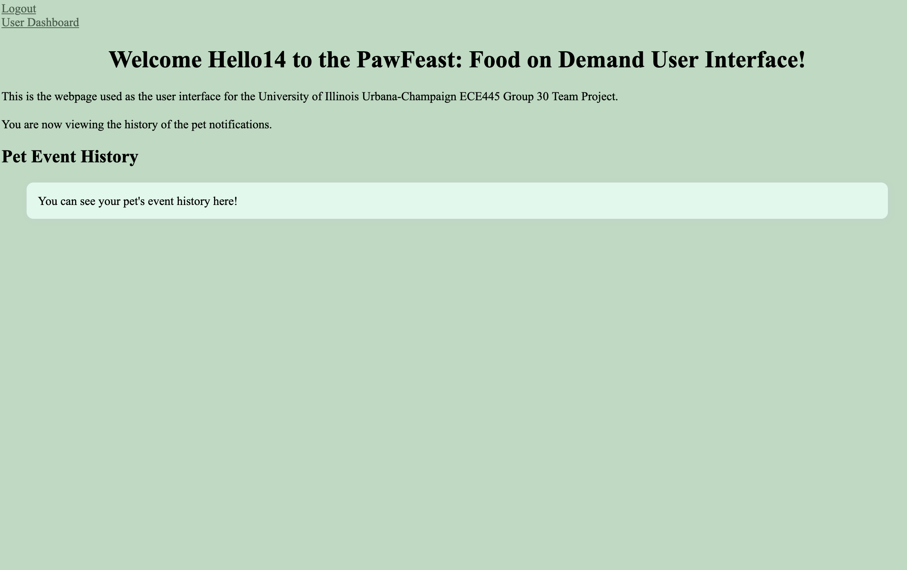

## Template for Notebook Entries
Date:         _xx/xx/xxxx_  
Objectives:   _What are the goals for the meeting?_  
Record:       _What did we accomplish?_

## Meeting #1
Date:         _12/31/2024 (Recorded for reference on 1/23/2025)_  
Objectives:   The goal of this meeting was to meet my teammates and brainstorm ideas of what we could work on for our project.  
Record:       While meeting, we made suggestions of what we could work on. These ideas include the following:  
  1. Power conversion  
  2. Solar  
  3. Microcontroller  
  4. Solar power
  5. Something cyber related?
  6. Vehicle related
  7. Smart charger
  8. What to charge?
  9. Normal battery pack w/ Lithium ion battery
  10. Power source -> middle tool -> dispense to battery
  11. usbguard/equivalent for security to only allow authorized devices to connect

By the end of this meeting, we decided that we would work on something related to a smart charger. 

## Meeting #2
Date:         _1/21/2025 (Recorded for reference on 1/23/2025)_  
Objectives:   The goal of this meeting was to finalize the project idea and to submit a post to the web board for the initial project approval.  
Record:       At this meeting, we confirmed that we did want to pursue the smart charger project. We refined our project to focus on laptop-to-laptop charging capabilities, and added complexity by adding battery health monitoring and possibly being able to set a battery percentage value for the device to charge up to.  

At the end of this meeting, we submit our initial web board post.

## Meeting #3
Date:         _1/24/2025 (Recorded for reference on 1/28/2025)_  
Objectives:   The goal of this meeting was to discuss feedback received for our project idea and to decide to continue pursuing the project idea or look for a new idea to pursue.   
Record:       At this meeting, we confirmed that we could not continue to pursue the smart charger project due to TA feedback. We then brainstormed additional ideas and came up with a cheap, complete security system for college apartments.  

At the end of this meeting, we submit our initial web board post.

## Meeting #4
Date:         _1/27/2025 (Recorded for reference on 1/28/2025)_  
Objectives:   The goal of this meeting was to discuss feedback received for our project idea and to decide to continue pursuing the project idea or look for a new idea to pursue.  
Record:       After talking to TA's Jiankun and Michael, we determined that our idea for a security system may not be the best to pursue as our distinguishing factor is price and completeness as completeness is something that has already been achieved, it's just pricier.  

We then decided to focus on looking at pet feeders that feed pets while maintaining the freshness of the food. We submit the initial post to the web board for approval.

## Meeting #5
Date:         _1/28/2025_  
Objectives:   The goal of this meeting was to discuss feedback received for our project idea and draft a response to the feedback received entailing the project subsystems.  
Record:       After receiving feedback from Jason, we drafted our list of subsystems for our food dispensor.

At the end of this meeting, we posted our Project Proposal.

## Meeting #6
Date:         _2/3/2025_  
Objectives:   The goal of this meeting is to finish the soldering assignment, make the team contract, and set our goals for the semester.   
Record:       Team Contract is completed only requiring the addition of the meeting time with the TA. Project has been approved. Goals have been set.  

## Meeting #7
Date:         _2/10/2025_  
Objectives:   The goal of this meeting was to talk to Greg about project design and to work on project proposal.   
Record:       Project proposal was largely completed. Met with Greg for the first time. Drew a rough sketch of the physical design.  

## Meeting #8
Date:         _2/11/2025_  
Objectives:   The goal of this meeting was to further define project design with Greg and what we need to aquire for him. Additional goals were to work on project proposal.   
Record:       Project proposal was completed for review at TA meeting. Finalized design with Greg. Determined we needed to aquire a load cell for weight sensing, a motor for covering the food bowl, a stepper motor for food dispensing, a button to determine the presence of a dog, at least 2 LED tranceiver/receiver sets for food store capacity, and a food bowl to dispense food into. In addition, we needed to get a sample of dog food for Greg to get an idea of size.

## Meeting #9
Date:         _2/18/2025_   
Objectives:   The goal of this meeting was to practice our presentation for the Design Review.  
Record:       Practiced presentation for review tomorrow at 3PM. We agreed that we would meet 15-20 minutes in advance of the Proposal Review.

## Meeting #10
Date:         _2/24/2025_   
Objectives:   The goal of this meeting was to go over feedback from proposal review, finalize parts list and look at next steps. Met with TA for the last hour.    
Record:       Deliverables for breadboard demo:  
  1. project uses 2 or 3 different sensors working
  2. code running on microcontroller
  3. read and understand signals from the differrent sensors
  4. recieving some sort of thing
  5. microcontroller communication app is working, the app receives updates from the microcontroller
  6. motor works (on off), esp can send signals to change the speeds (dependent on the drivers)
  7. bluetooth to app good (but not critical)
  8. CODE IS VERY IMPORTANT
  9. app can be done in a week: mongodb, react

## Meeting #11
Date:         _2/25/2025_   
Objectives:   The goal of this meeting was to work on circuit, RFID, parts, and database.  
Record:       During this meeting, Omkar worked on the Brain circuit, Arash worked on the RFID parts, and I worked on the Database schema. Files for the database can be referenced [here](../../UI/).

## Meeting #13
Date:         _3/4/2025_   
Objectives:   The goal of this meeting talk to Aishee Mondal about our power and brain breadboard in order to order the first round of PCBs.  
Record:       During this meeting, talked with Aishee about deliverables, went over schematics, requested stencils for the PCBs, discussed parts ordering and immediate plan.  

## Meeting #14
Date:         _3/5/2025_   
Objectives:   The goal of this meeting finish the design document (due 3/6).  
Record:       During this meeting, we worked on the parts list, cost analysis, and Requirements and Verification Table. Outside of the parts list, the design document was finished. We will begin majority of parts ordering this weekend along with testing of sensors and MCU/ESP32 chip. I worked on the user interface. The database is fully created and connected with our backend. The backend is connected to our frontend. As of now, we are able to create users, login, and logout.  

A detailed description of our database schema can be found at [here](./database_schema.md).

This is a screenshot of the current version of the code.

## Meeting #15
Date:         _3/11/2025_   
Objectives:   The goal of this meeting was to finish preparing for the breadboard demo.   
Record:       During this meeting, we tested the RFID, Load Cell, and Presence Sensor Code on the Arduino for the breadboard demo. We have successfully gotten the code to work and combined them into one file.  

A detailed description of our Software code for the Arduino Breadboard Demo can be found on the main branch under SoftwareFiles.

This is a screenshot of the current Dashboard and History page of the user interface.
 

