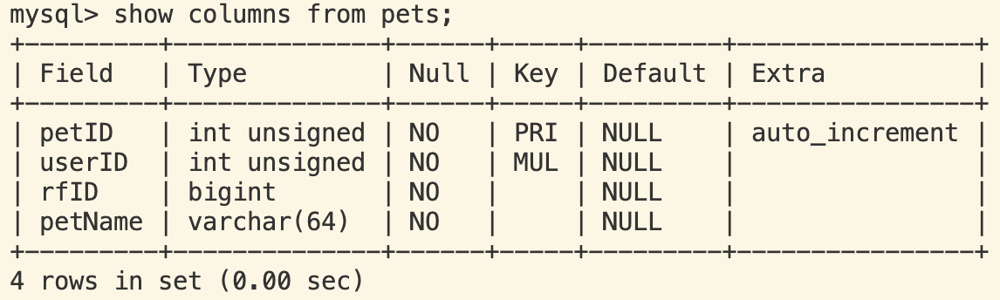

# ECE445 PawFeast: Food on Demand Database Schema
This document describes the Senior Capstone Project resulting from ECE445 at the University of Illinois.  

This document will detail the progress, commands, and details related to the database for Team 30.  

The database schema can be seen below. 


The Tables can be seen below.


These tables can be found by running the following:
```
show databases;
use ece445_project;
show tables;
```

Table columns may be seen as:
```
show columns from [table name];
```

These are the values and types for each table:




