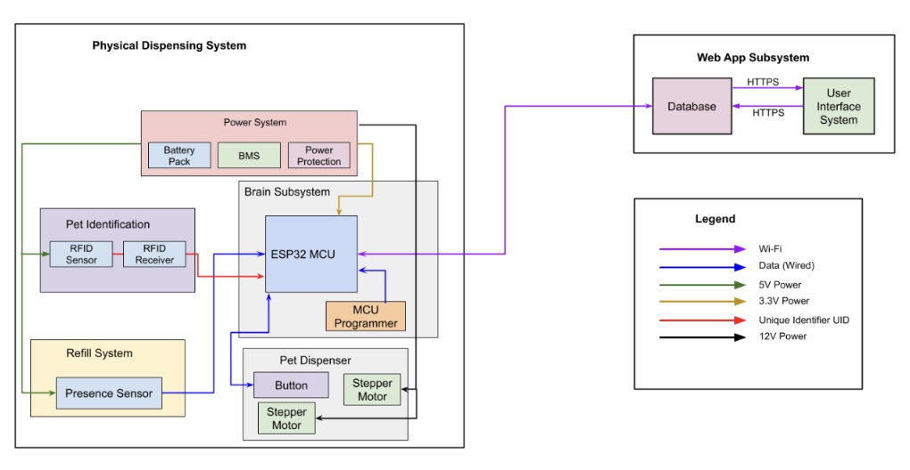
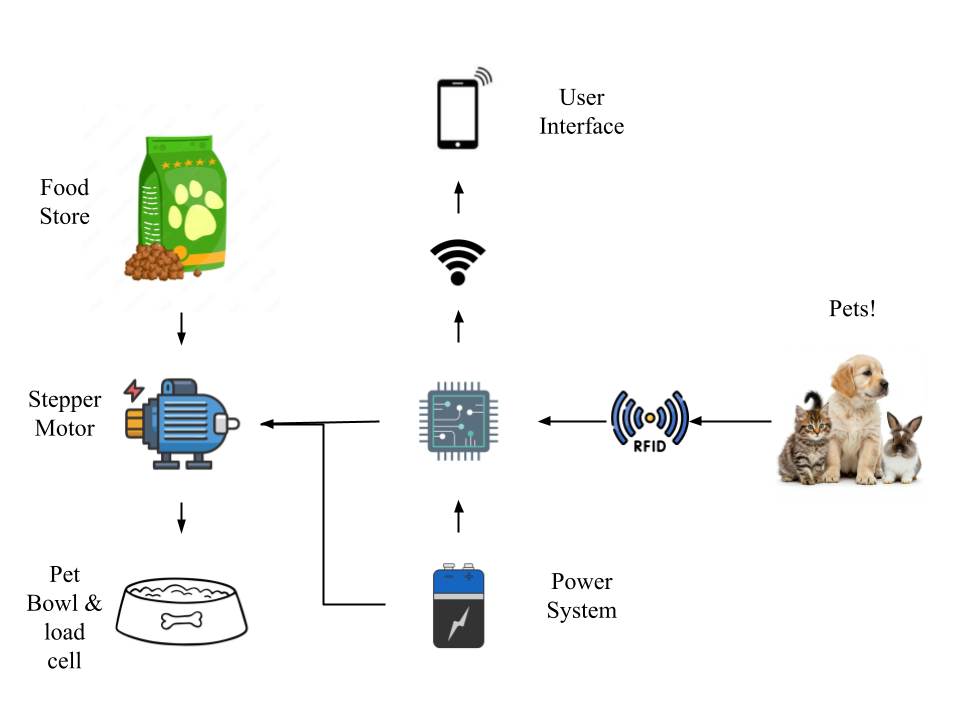

# Omkar's Digital Notebook

This file serves as a digital notebook for my ECE 445: Senior Design project.

# 01/21/2025

After the first ECE 445 lecture, the group assembled to discuss and hash-out viable ideas for our project. We had previously met during winter break and gone through a number of project ideas related to solar power, cybersecurity, microcontroller development, vehicle architecure, cell balancing, and smart charging. In this session, the group researched ideas that fit the complexity and scope of what we believed was expected of us by the course staff. We made an initial project proposal post on the web board on smart charging technology, which includes battery health monitoring, voltage/current control, possibly the abilility to set charging percentage, and the ability to charge laptop-to-laptop. In this process, we discarded ideas related to cell-balancing and security because they were either too complex to implement or the group (as a whole) did not have enough expertise to pursue the idea.

We got an opportunity to ask the head TA about course logistics and project complexity. His feedback suggested that laptop-to-phone charging was too simple and if we wanted to work on high-voltage charging, every member of the group would need to get trained. Currently, we are assessing what is possible to complete within a semester and still complex enough to aim for being a featured project.

# 01/20/2025

The group's initial idea of laptop to laptop charging was said to be not probable to complete by TA recommendation, mainly because of the usb-c module and the fact that the Macbook BMS already regulated the battery charge. Also, the TA mentioned how latop charging in general is unidirectional which makes sense.

In this meeting and in one before, the group discussed alternate strategies or ideas to implement for this project. The first idea that I came up with was to discard laptop-to-laptop charging and go with wall/grid to laptop charging. This would still have features to measure and set the battery voltage/charge. Another idea was to have an elderly fall protection system, which detected when someone fell or had an accident, and sent a notification to their immediate family members. Additionally, we thought about the idea of fall protection and then expanded to adrenaline-sports. Arash then thought about an idea where an automonous or robot vehicle would measure the soil health and plant seeds at some interval. The robot would use moisture sensors, servo motors, and other sensors to move around, but the group did not have a lot of robotics experience, so we are putting this idea on the backseat.

Kathryn came up with an idea for a security system, and we were hoping to move forward with that, but the issue is that there are many companies who have all sorts of sensors commercially for what we were trying to add (such as smoke/CO2 detectors). So it is difficult to choose home secutity without having some unique sensor or system that is different from all the commercial products on the market. We were hoping to have a system that include motion and radar sensors for detecting individuals in the apartment, and checking if doors/windows have been opened. Our next idea that we are currently in the process of thinking about is an automatic pet feeder device that has subsystems: a system to drop the food based on a timer or pressure sensor, to cover the bowl, to notify the owner when the pet eats, to measure the bowl to see how much food has been eaten.

# 02/03/2025

The statement of objective for this meeting was to discuss group rules/communication stratgies for the upcoming semester and start working on a high level design architecture for our project. We also hoped to finalize a parts list.

The issue is that our project has not yet been approved, so we decided it would be best if we moved forward under the assumption that we would need to change anything drastically. We completed writing our group contract and will until our project gets approved before submitting it—the contract covers group roles, distribution of work, and ground rules. The group added weekly goals to this, and now, we have a much better timeline of what to focus on each week for the next 13 weeks. The roles were split based on personal preference and strengths—since I have the most experience with PCB design and layout, I was tasked on working with the brain board as well as the power board. Arash is working on the sensors aspect which dictate when the food drops and how to cover it (as well as some mechanical/structural aspects). Kathryn is working primarily on the software/front-end application and the RFID/user interfaces. Some of the project aspects will be split up based on workload, but this is the general distribution.

We continued discussing some of the design aspects to our project, but didn't discuss parts except for confirming that we were going ahead with the ESP32 microcontroller. We also had a number of questions about some aspects of the course like we were required to complete a breadboarded circuit and a breadboard demo when our parts are tiny SMD components that are best implemented on PCBs.

# 02/10/2025

The statement of objective for this meeting was to plan out a more detailed parts list, talk with Greg about the feasability of our build, and start working on our project proposal. During this meeting, the group discussed our various subsystems and specific sensors, deciding on utilizing a proximity sensor for the food store. We talked with Greg for 15 minutes about our design; in the process, we decided to go with two motors (a stepper motor for the dispensing and a linear actuator or drivebox for closing the bowl lid), a button, and some sensor for the food detection.

# 02/11/2025

The statement of objective for this meeting is to finalize design plans with Greg (the machine shop) and finish up the project proposal before our TA meeting with Aishee. The group had a 30 minute chat with Greg about all of the components he needs to help build the pet dispensor and decided to switch from a proximity sensor to an LED transmit/recieve type of sensor. We also realized that the machine shop has not built any large dispensors before, so we will need to communicate more on our requirements. We are still working to finish the Visual and Block Diagram parts of the project proposal.

# 02/13/2025

The statement of objective for this meeting is to finish the project proposal and begin finalizing part selection. The group discussed whether the reflective object sensor was superior to the presence sensor, and read all of the datasheets for the sensor components—mainly to find the power requirements. The tolerance analysis, block diagram, and visual were the last pieces to finish and the latter two were completed during the meeting. The tolerance analysis was written in overleaf latex after all of the sensors, motor drivers, and other parts were selected.

Another big thing was the power supply. The group has decided to create our own 3s2p pack from lithium-ion cells and a BMS board that we found online. The benefits of this are that we can power the motor drivers with 12V rather than 5V, which is the recommended voltage for our chips. The other positive is that other batteries like AA start dropping their supply current when the voltage of the cell decreases, but this is very bad. This does not occur with Li-ion batteries, and keeps to our original portable/rechargable mentality rather than using the wall. Worst comes to worst, the plan is to add a barrel jack connector that can connect to a wall plug if necessary, so we can at least run the microcontroller and sensors, possibly even switch to a 5V motor driver, but that's a last resort and it's good to have a backup plan. I will upload some of our project files like the proposal to the main branch folder for reference.

# 02/17/2025

The statement of objective for this meeting is to submit the parts request, at least some initial ones that will be needed by the machine shop team to start building the food store and structure. Our TA meeting is also right after, so we can have Aishee approve the essential or time-dependent parts immediately (so we can wait less for the whole approval from the department).

Our TA meeting was canceled this week due to the proposal reviews and we realized that there were some suitable parts in the supply shop inventory, so the group held off on ordering. Instead we focused on improving our proposal for the proposal review based on what we saw from group presentations today. I added text to our visual aid and looked into the driver circuit for the steppor motors. Arash went to talk with Greg again and made sure that we knew what parts he needed for the build, while Kathryn worked on adding these parts to our parts list (such as the NEMA-17 motors and the dog food bowl).

# 02/19/2025

The statement of objective for this meeting is to prepare for the proposal review meeting tomorrow and order the rest of the parts. We also want to start working on some of the circuit design aspects for the motor drivers and microcontroller.

We did not order the parts, but we did look into some more of the circuit design details. We didn't know that a level shifter was necessary to regulate voltage to the microcontroller at a signal level from the sensors. We also drastically improved our block diagram, made many changes to our proposal (essentially completing the proposal v2 assignment), and practiced presenting our proposal (Dry runs). We cut down on the fluff and the whole group got on the same page about some of our design choices and the aspects of the problem we are trying to solve.

# 02/24/2025

The statement of objective for this meeting is to order the parts that Greg needs for helping us build our design. We are also hoping to order many of the other parts after determining which parts overlap with the supply shop inventory. In order to do this, we will need to look into the subcircuit design for the motor drivers. The custom battery pack cannot be built until OpenLab gets some new tips for their spot-welder which is necessary for spot-welding the nickel strips onto the lithium-ion cells.

# 02/25/2025

The statement of objective for this meeting is to finish ordering the parts and keep working on the physical design of the sensor and driver circuits.

# 02/27/2025

The statement of objective for this meeting is to start finalizing the circuit design aspects and get familiar with UART and RFID protocols.
