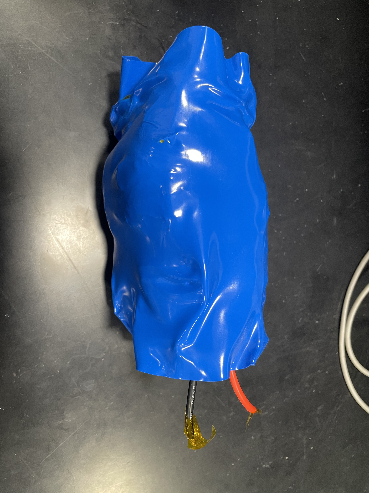

# Omkar's Digital Notebook

This file serves as a digital notebook for my ECE 445: Senior Design project.

# 01/21/2025

After the first ECE 445 lecture, the group assembled to discuss and hash-out viable ideas for our project. We had previously met during winter break and gone through a number of project ideas related to solar power, cybersecurity, microcontroller development, vehicle architecure, cell balancing, and smart charging. In this session, the group researched ideas that fit the complexity and scope of what we believed was expected of us by the course staff. We made an initial project proposal post on the web board on smart charging technology, which includes battery health monitoring, voltage/current control, possibly the abilility to set charging percentage, and the ability to charge laptop-to-laptop. In this process, we discarded ideas related to cell-balancing and security because they were either too complex to implement or the group (as a whole) did not have enough expertise to pursue the idea.

We got an opportunity to ask the head TA about course logistics and project complexity. His feedback suggested that laptop-to-phone charging was too simple and if we wanted to work on high-voltage charging, every member of the group would need to get trained. Currently, we are assessing what is possible to complete within a semester and still complex enough to aim for being a featured project.

# 01/22/2025

The group's initial idea of laptop to laptop charging was said to be not probable to complete by TA recommendation, mainly because of the usb-c module and the fact that the Macbook BMS already regulated the battery charge. Also, the TA mentioned how latop charging in general is unidirectional which makes sense.

In this meeting and in one before, the group discussed alternate strategies or ideas to implement for this project. The first idea that I came up with was to discard laptop-to-laptop charging and go with wall/grid to laptop charging. This would still have features to measure and set the battery voltage/charge. Another idea was to have an elderly fall protection system, which detected when someone fell or had an accident, and sent a notification to their immediate family members. Additionally, we thought about the idea of fall protection and then expanded to adrenaline-sports. Arash then thought about an idea where an automonous or robot vehicle would measure the soil health and plant seeds at some interval. The robot would use moisture sensors, servo motors, and other sensors to move around, but the group did not have a lot of robotics experience, so we are putting this idea on the backseat.

Kathryn came up with an idea for a security system, and we were hoping to move forward with that, but the issue is that there are many companies who have all sorts of sensors commercially for what we were trying to add (such as smoke/CO2 detectors). So it is difficult to choose home secutity without having some unique sensor or system that is different from all the commercial products on the market. We were hoping to have a system that include motion and radar sensors for detecting individuals in the apartment, and checking if doors/windows have been opened. Our next idea that we are currently in the process of thinking about is an automatic pet feeder device that has subsystems: a system to drop the food based on a timer or pressure sensor, to cover the bowl, to notify the owner when the pet eats, to measure the bowl to see how much food has been eaten.

# 02/03/2025

The statement of objective for this meeting was to discuss group rules/communication stratgies for the upcoming semester and start working on a high level design architecture for our project. We also hoped to finalize a parts list.

The issue is that our project has not yet been approved, so we decided it would be best if we moved forward under the assumption that we would need to change anything drastically. We completed writing our group contract and will until our project gets approved before submitting it—the contract covers group roles, distribution of work, and ground rules. The group added weekly goals to this, and now, we have a much better timeline of what to focus on each week for the next 13 weeks. The roles were split based on personal preference and strengths—since I have the most experience with PCB design and layout, I was tasked on working with the brain board as well as the power board. Arash is working on the sensors aspect which dictate when the food drops and how to cover it (as well as some mechanical/structural aspects). Kathryn is working primarily on the software/front-end application and the RFID/user interfaces. Some of the project aspects will be split up based on workload, but this is the general distribution.

We continued discussing some of the design aspects to our project, but didn't discuss parts except for confirming that we were going ahead with the ESP32 microcontroller. We also had a number of questions about some aspects of the course like we were required to complete a breadboarded circuit and a breadboard demo when our parts are tiny SMD components that are best implemented on PCBs.

# 02/10/2025

The statement of objective for this meeting was to plan out a more detailed parts list, talk with Greg about the feasability of our build, and start working on our project proposal. During this meeting, the group discussed our various subsystems and specific sensors, deciding on utilizing a proximity sensor for the food store. We talked with Greg for 15 minutes about our design; in the process, we decided to go with two motors (a stepper motor for the dispensing and a linear actuator or drivebox for closing the bowl lid), a button, and some sensor for the food detection.

# 02/11/2025

The statement of objective for this meeting is to finalize design plans with Greg (the machine shop) and finish up the project proposal before our TA meeting with Aishee. The group had a 30 minute chat with Greg about all of the components he needs to help build the pet dispensor and decided to switch from a proximity sensor to an LED transmit/recieve type of sensor. We also realized that the machine shop has not built any large dispensors before, so we will need to communicate more on our requirements. We are still working to finish the Visual and Block Diagram parts of the project proposal.

# 02/13/2025

The statement of objective for this meeting is to finish the project proposal and begin finalizing part selection. The group discussed whether the reflective object sensor was superior to the presence sensor, and read all of the datasheets for the sensor components—mainly to find the power requirements. The tolerance analysis, block diagram, and visual were the last pieces to finish and the latter two were completed during the meeting. The tolerance analysis was written in overleaf latex after all of the sensors, motor drivers, and other parts were selected.

Another big thing was the power supply. The group has decided to create our own 3s2p pack from lithium-ion cells and a BMS board that we found online. The benefits of this are that we can power the motor drivers with 12V rather than 5V, which is the recommended voltage for our chips. The other positive is that other batteries like AA start dropping their supply current when the voltage of the cell decreases, but this is very bad. This does not occur with Li-ion batteries, and keeps to our original portable/rechargable mentality rather than using the wall. Worst comes to worst, the plan is to add a barrel jack connector that can connect to a wall plug if necessary, so we can at least run the microcontroller and sensors, possibly even switch to a 5V motor driver, but that's a last resort and it's good to have a backup plan. I will upload some of our project files like the proposal to the main branch folder for reference.

# 02/17/2025

The statement of objective for this meeting is to submit the parts request, at least some initial ones that will be needed by the machine shop team to start building the food store and structure. Our TA meeting is also right after, so we can have Aishee approve the essential or time-dependent parts immediately (so we can wait less for the whole approval from the department).

Our TA meeting was canceled this week due to the proposal reviews and we realized that there were some suitable parts in the supply shop inventory, so the group held off on ordering. Instead we focused on improving our proposal for the proposal review based on what we saw from group presentations today. I added text to our visual aid and looked into the driver circuit for the steppor motors. Arash went to talk with Greg again and made sure that we knew what parts he needed for the build, while Kathryn worked on adding these parts to our parts list (such as the NEMA-17 motors and the dog food bowl).

# 02/19/2025

The statement of objective for this meeting is to prepare for the proposal review meeting tomorrow and order the rest of the parts. We also want to start working on some of the circuit design aspects for the motor drivers and microcontroller.

We did not order the parts, but we did look into some more of the circuit design details. We didn't know that a level shifter was necessary to regulate voltage to the microcontroller at a signal level from the sensors. We also drastically improved our block diagram, made many changes to our proposal (essentially completing the proposal v2 assignment), and practiced presenting our proposal (Dry runs). We cut down on the fluff and the whole group got on the same page about some of our design choices and the aspects of the problem we are trying to solve.

# 02/24/2025

The statement of objective for this meeting is to order the parts that Greg needs for helping us build our design. We are also hoping to order many of the other parts after determining which parts overlap with the supply shop inventory. In order to do this, we will need to look into the subcircuit design for the motor drivers. The custom battery pack cannot be built until OpenLab gets some new tips for their spot-welder which is necessary for spot-welding the nickel strips onto the lithium-ion cells.

# 02/25/2025

The statement of objective for this meeting is to finish ordering the parts and keep working on the physical design of the sensor and driver circuits.

We did not finish ordering the parts today, but we had a great conversation with Aishee about what parts to select, what "break-out" boards are okay to use (i.e. case by case basis on complexity of design versus how relevant it is to your project), and what the breadboard demo will entail. We also discussed as a group what needs to get done to prepare for the board send out next week. I started looking into some of the circuits and wiring for the different subsystems (picture below). The group also checked out a dev board ESP32 and two RFID tags for the breadboard demo. There were two main points that we discussed: one was our deliverables for the breadboard demo and the other was the utilization of a combined RFID board (with the reader and MCU interface), so we don't need to spend a lot of money on a programmer.

Here are the deliverables for the breadboard demo, written/recorded by Kathryn:

1. Project uses at least 2 or 3 different sensors working
2. Code is running on the microcontroller
3. Microcontroller reads and understands signals from the different sensors
4. Receiving some sort of thing to the app,
5. Microcontroller communication to app is working, the app receives updates from the microcontroller
6. Motor works (on/off), esp can send signals to change the speeds (dependent on the drivers)
7. Bluetooth to app good (but not critical)
8. CODE IS VERY IMPORTANT
9. App can be done in a week

# 02/27/2025

The statement of objective for this meeting is to start finalizing the circuit design aspects and get familiar with UART and RFID protocols.

I got a lot of work done on the brain board and started working on the layout for the power board.

# 03/03/2025

The statement of objective for this meeting was to discuss what we needed to do for the breadboard demo next week and talk with Aishee on more specific questions or logistics. One important thing Kathryn asked was whether the $50/person stipend could be used for any member of the group and the answer was that it cannot. So if one person uses $48 and another member uses $47, we would not be able to buy a part that is $5 between the two of us (at least that's how I understood the situation). The power board is complete and sent out, while the schematic for the brain board was completed over the weekend, both images below.

The plan for the remaining week is:
Tuesday: group meeting finish design doc

Thursday: group meeting, program esp32 and connect/sense/signals

Omkar: finish RFID schematic, work on brain layout

Arash: finish motor driver schematic and start motor driver layout, make price table for all parts

Kathryn: finish backend/website, get ESP32 to send and receive WiFi

In addition to the above, we will prepare for the breadboard demo by getting some signals sensed by our ESP32 dev board and then sent to the database through WiFi. We also are waiting on all of our parts to give to the machine shop, so hopefully we can do that next week before break starts, so they have enough time to start working on the physical food store build.

# 03/04/2025

The statement of objective for this meeting is to finish the design document and continue working on the work distribution that we decided on last meeting.

This week, the group finished and submitted the design document. Arash made parts requests from the E-shop and made an inventory for all of the PCB parts on the spreadsheet. We selected how many of each part to buy based on what the part was used for and its frequency—the bootstrap 10 ohm resistor for example is only needed for one power subcircuit so we got much less than 10k ohm resistors, which are used for all of our pullups. Part ordering will be done by today (03/07/2025) as will the RFID schematic. I finished drawing it out, but still need to finetune the LC antenna head, which is something I've never done. I'm using the following resources:

[How to Design PCB Antennas](https://www.proto-electronics.com/blog/how-to-design-pcb-antennas)
[RFID MFRC522 Datasheet](https://mm.digikey.com/Volume0/opasdata/d220001/medias/docus/373/MFRC522.pdf)
[Arduino Forum](https://forum.arduino.cc/t/rfid-antenna/20271/2?_gl=1*1umnrkc*_up*MQ..*_ga*MTQ2NzQwNzMyLjE3NDEyODgyODE.*_ga_NEXN8H46L5*MTc0MTI4ODI3OC4xLjAuMTc0MTI4ODI3OC4wLjAuMTQyNTI2MTU5Ng..)

The brain layout is a work in progress, and Arash will finish the driver circuit this weekend. Kathryn has made her website functional, so now we can test the ESP32 dev board signals (and hopefully send those to the backend through WiFi). Overall, we are a little behind on sending the boards out, but we are focusing on the breadboard demo next week.

# 03/10/2025

The statement of objective for this meeting was to work on getting the microcontroller (ESP32-S3-WROOM-1) programmed with something basic and later with RFID and WiFi. We weren't able to program the RFID, but got an LED flashing and got the RFID dev board connected to the ESP32 dev board. The LED wasn't flashing before because we set the wrong pin in the Arduino code, but after we fixed it, we moved the LED (and current-limiting resistor) around and it still blinked properly. There was some terminal error about RTC WDT reset, but looks like that is common and not an issue. Kathryn started looking into getting WiFi working by using her laptop as the server (as opposed to the dev board); we made this choice because then if it works, we know that with our actual brain PCB, the microcontroller should also connect to her laptop properly. Arash finished ordering all of the parts after compiling everything and being in constant discussion with me on how many we actually should buy based on how many we need for each subcircuit.

I decided to move the brain power subcircuits (12-5, 12-3v3, and 5-3v3) onto a separate board for modularity sake and the brain board was starting to get overpopulated. I finished the layout and checked the gerbers on PCBway's site, and they passed, so I sent them to Aishee for the second PCB order. Arash will work on the motor driver schematic, and then pass it off to me for the layout; the hope is to finish that board for the second round as well. Aishee told us that there was a good chance the RFID breakout usage would get approved, so we decided not to spend time making the layout for that board. The schematic is not super complicated except for the antenna, which I discussed in a previous journal entry because of all of the thought that needs to go into it and I'm not an RF expert. The second power board schematic and 3d view are below:

We are gearing up for the breadboard demo on Wednesday. An issue was that both of our dev boards for the breadboard demo came on Friday 1 pm or before, and we didn't get a notification because they didn't get processed, so we didn't get the weekend to test the motor drivers and load cell. We need to give some parts to Greg before break starts, so this was a hindrance.

# 03/11/2025

Today the group worked mostly individually on their aspects of the project. The main parts for the breadboard demo have not arrived like our breakout boards, so we are hoping to work on it tomorrow. I started working on the brain layout and realized there were some mistakes in the schematic like double test points and I didn't have an LED debugging circuit. There are also two 10k resistors in the Presence Sensor area (one was for the level shifter, the other was for the presence sensor itself, but they are at the same node, so they are essentially in parallel, which is making one redundant). I'll fix that as well as in the layout I realized, the 5V power input connector should go below the JTAG and motor controller ones because that power trace is just going straight down, which is pretty bad. I'm trying not to let the traces cross under each other too much, but it's pretty difficult. Kathryn was working on RFID and then WiFi for two hours, while I was giving moral support and working on my brain layout—she was able to get RFID code working after realizing our tags are incompatible with the FRC522 board, so we are buying new tags. The previous ones were rented from the class supply. Arash is working on the motor driver board right now and we collaborated on some schematic conventions etc. Overall, we are looking to send out three boards this board run: brain, second power, and motor driver, while concurrently, preparing for our breadboard demo on Wednesday.

# 03/12/2025

The group met and did all of the work for the breadboard demo now that our parts have arrived. This fulfilled the statement of objective for the meeting. The group was able to get RFID sensing with one tag, get the motor running, get the load cells measuring, and get the presence sensor reading whether the connection was broken or unbroken (depending on if there was an object in between).

# 03/31/2025

It's been a busy couple of weeks. Our first and second order PCBs have arrived and the team is working on populating the boards. We used the DDM Novastar GF-B-HT Reflow Oven for the first time with Chipquik TS391SNL50 (Sn96.5/Ag3.0/Cu0.5) solder paste with a temperature of 240C, a Ta of 180 seconds, and a Tb of 240 seconds. We still need some more parts, so we have not been able to test if the MCU is propely placed and the joints are well-connected, but visually speaking, everything looks aligned. The ESP32 Wroom 32E dev board has arrived, so Kathryn is working on moving the Arduino code from the RFID to the dev board and Arash is working on moving the motor controller Arduino code to that. This will tell us whether the brain board I made made and assembled is working properly by unit testing on the dev board first.

I successfully created the 3s2p Li-ion battery pack (photos below), and tested the voltage on that, so looks like that should be good to go. The BMS is 3rd party, so hopefully it is not faulty.

